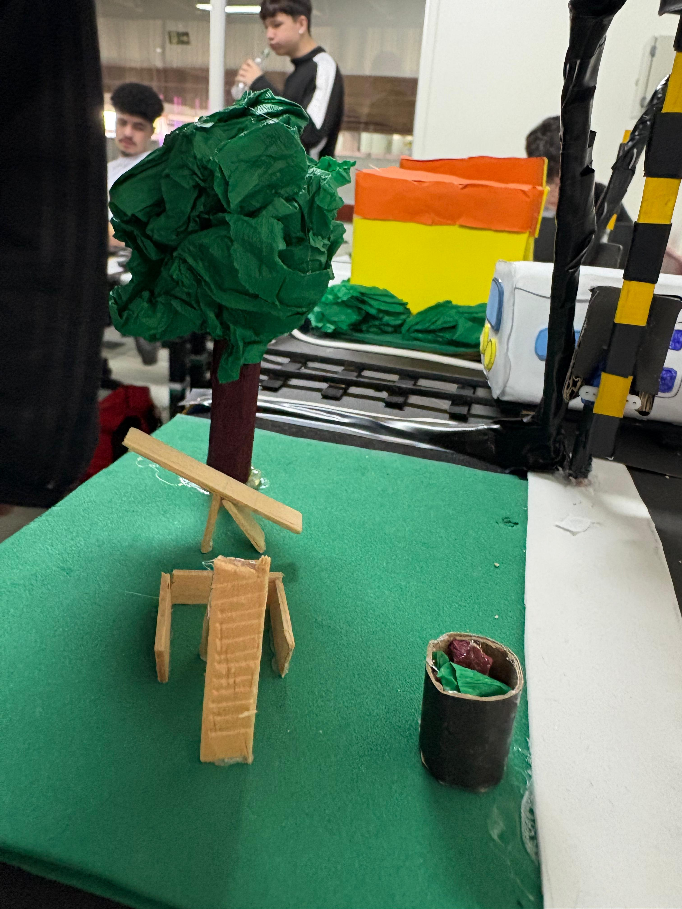
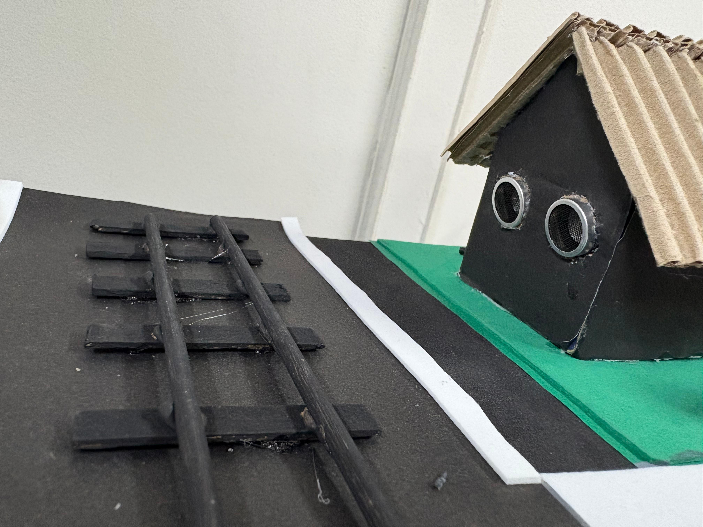
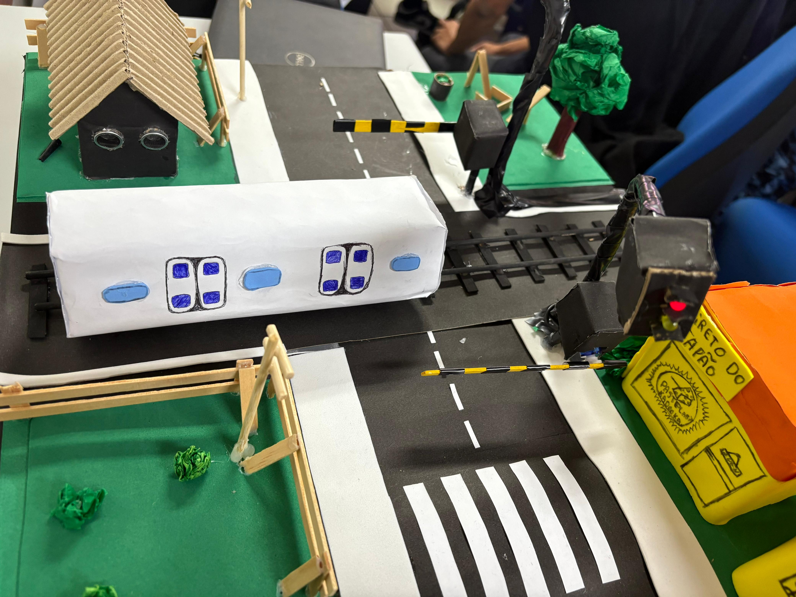

# 🚦 Trabalho Semáforo Inteligente

Projeto acadêmico sobre um sistema de **semáforo inteligente**, com foco em eficiência no tráfego urbano utilizando sensores, lógica de programação e automação.

> **Possui os arquivos do documento ABNT e dos vídeos.**

---

O projeto consiste em um protótipo que deva suprir as necessidades de um cruzamento, com a adição de um **semáforo inteligente**. 🚗🚥
Toda a confecção do projeto foi realizada a partir da **metodologia ágil**, separada durante 6 meses em 3 sprints, para uma equipe composta de **6 pessoas**;

>• 1 Scrum master;

>• 5 Desenvolvedores.

 
  
<h2> Sprint 1 🏃‍➡️</h2>

#### 🚦🚨 Durante toda a primeira etapa do desenvolvimento a Kanalli corp. realizou utilizando um kit de Arduino Uno, a construção de um semáforo convencional.
Com o apoio da plataforma tinkercad, aprendemos como funciona toda a estrutura de um Arduino e suas ligações, logo após, realmente colocando a mão na massa, pegamos pratica e depois do teste com semáforo convencional, o incrementamos ainda mais, com instrumentos como por exemplo botões e mais leds, nos preparando aos poucos para fazer o trabalho final. ⏱️

---

 
  
<h2> Sprint 2 🏃‍➡️🏃‍➡️</h2>

#### 🚦 Durante toda a segunda etapa do desenvolvimento a Kanalli corp. realizou utilizando um kit de Arduino Uno, a construção de um semáforo, semi inteligente, com sensores. 🚨
Novamente após dominar a montagem de ligações simples, fizemos um semáforo convencinal, porém logo adicionamos sensores, neste caso o sensor ultrassônico, enfim começando os testes para adição do semáforo inteligente na maquete. ⏲️

  
 ---

 
 
  
<h2> Sprint 3 🏃‍➡️🏃‍➡️🏃‍➡️</h2>

#### 🚦 Durante toda a terceira etapa do desenvolvimento a Kanalli corp. realizou utilizando kits de Arduino Uno, a construção de uma maquete, de semáforo inteligente, que incluia todo nosso conhecimento prévio. 🚨
A terceira e ultima etapa do projeto, foi a mais importante e assim a mais desafiadora, foi a que exigiu mais da equipe e solicitou uma maior organização e proatividade.
A equipe foi dividida entre funções, denominadas pelo Scrum Master, para otimizar o tempo de produção. A equipe então ficou em grupos; 

**• 2 componentes cuidando predominantemente do código que seria usado na maquete;**

**• 3 componentes cuidando da ambientação e planejamento da estutura;**

**• 1 componente realizando um trabalho geral, localizando onde era necessário ajuda e então auxiliando.**

---

# 🚥 Ideia Final e Diferencial
Na confecção durante uma troca de ideias a equipe após observar casos em noticias, notou uma deficiência, que é ainda maior no trânsito das areas rurais, e então procurou por uma estrutura que esteja predominantemente nestas áreas.
Então foi decidido que a maquete, contendo o semáforos inteligentes, seria aplicada em um cruzamento, diferente do convencional, um que possuí uma estrada de carros cortada por um trilho de trem. 🚂🛤️

A equipe então após todo o planejamento e confecção, fez a montagem de um cruzamento rodoferroviário, que continha sensores no trilho, que então ajudaram os semáforos, presentes um em cada lado da pista, à fecharem, junto com um sistema de cancela que prioriza a segurança de pedestres e também de veiculos. 🚶‍♂️🚗

---

 
  
<h2> Imagens 📸</h2>

---

<table>
  <tr>
    <td>
         
       
    </td>
    <td>
       
    </td>
  </tr>
</table>

---

---
